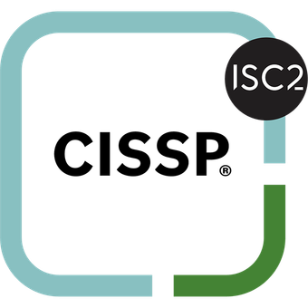
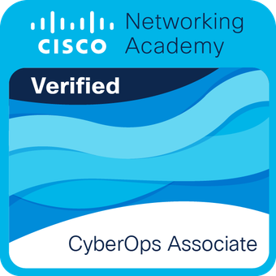

---
hide:
  - toc
---

# Skills

How these show up in an actual investigation is on the
[home page](index.md). This is the kit.

## Toolkit

  

    <button data-filter="all" aria-pressed="true">All</button>
    <button data-filter="forensics" aria-pressed="false">Forensics</button>
    <button data-filter="detect" aria-pressed="false">Detect</button>
    <button data-filter="cloud" aria-pressed="false">Cloud</button>
    <button data-filter="intel" aria-pressed="false">Intel</button>
    <button data-filter="build" aria-pressed="false">Build</button>
  

  

    <h3>Forensics &amp; analysis</h3>
    

      VolatilityMemProcFS
      KAPEAxiom
      FTK ImagerWireshark
      YARABulk Extractor
      Presidio
    

  

  

    <h3>Detection &amp; monitoring</h3>
    

      CrowdStrike EDRSecOps SIEM
      SplunkElastic
      WizIDS/IPS
    

  

  

    <h3>Cloud &amp; platform</h3>
    

      AWSGCP
      OpenStackDocker
    

  

  

    <h3>Threat intelligence &amp; vulnerability management</h3>
    

      Recorded FutureFlashpoint
      MISPQualys
      Rapid7 InsightVM
    

  

  

    <h3>Automation</h3>
    

      PythonAnsible
      PackerShell
    

  

## Certifications

 <a class="pf-certcard" href="https://www.credly.com/badges/b40d1bb3-3fb8-43f5-850e-45b9ff341f47/public_url" target="_blank" rel="noopener noreferrer">
  
  

   <h3>CISSP</h3>
   
Certified Information Systems Security Professional, (ISC)&sup2;

   Verify on Credly
  

 </a>

 <a class="pf-certcard" href="https://www.credly.com/badges/4a35b5bb-41b9-42a0-9896-1e018c1f860e/public_url" target="_blank" rel="noopener noreferrer">
  
  

   <h3>Cisco CyberOps Associate</h3>
   
Security monitoring, host and network analysis, incident response

   Verify on Credly
  

 </a>

Also certified

 

  <b>Splunk Core Certified User</b>
  Log analysis, advanced search, dashboards
 

 

  <b>Palo Alto Cortex XSOAR</b>
  SOAR platform fundamentals
 

 

  <b>Penetration Testing &amp; Vulnerability Assessment</b>
  Reconnaissance, Metasploit, Nmap
 

